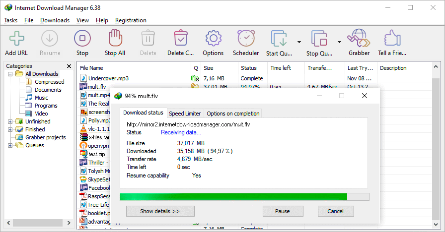
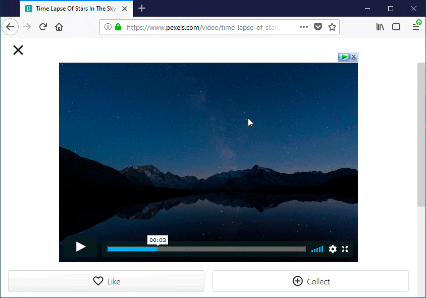
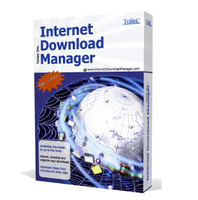

###  网络下载管理器

# 最多可将下载速度提高 5 倍！

Internet 下载管理器 (IDM) 是一种将下载速度提高多达 5 倍、恢复和安排下载的工具。

## 下载更快更可靠

安装 Internet 下载管理器 (IDM) 以停止等待下载。您会真正惊叹 IDM 下载文件的速度有多快。IDM 还将修复因连接丢失、网络问题、计算机关机或意外断电而中断的下载并恢复中断的下载。

## 强大的下载引擎

我们强大的下载引擎使用独特的算法以最快的方式接收 Internet 数据。由于其创新的动态文件分割技术，IDM 将始终加速下载。与其他下载管理器和加速器不同，IDM 在下载过程中动态地对下载的文件进行分段，并且它重用可用连接而无需额外的连接和登录阶段，以实现最佳加速性能。我们的工程师在下载加速方面有着丰富的经验，我们从 1999 年开始不断改进这个下载引擎。

## 支持所有流行的浏览器

IDM 无缝集成到 Google Chrome、FireFox、Microsoft Edge、Opera、Safari、Internet Explorer、AOL、MSN、Maxthon 和所有其他流行的浏览器。我们从 1999 年开始开发浏览器扩展，我们拥有当今最好的工程解决方案。IDM提供了扩展的安装 [Chrome浏览器](https://chrome.google.com/webstore/detail/IDM-Integration-Module/ngpampappnmepgilojfohadhhmbhlaek)， [火狐](https://addons.mozilla.org/en-US/firefox/addon/tonec-idm-integration-module/)， [老](https://www.microsoft.com/p/idm-integration-module/9p5qlkvjh982)和 [新的边缘](https://www.internetdownloadmanager.com/register/new_faq/edge_extension.html)， [歌剧](https://www.internetdownloadmanager.com/register/new_faq/bi7.html)和其他浏览器。

安装[IDM扩展谷歌浏览器](https://chrome.google.com/webstore/detail/IDM-Integration-Module/ngpampappnmepgilojfohadhhmbhlaek)
安装[IDM附加Mozilla Firefox的](https://addons.mozilla.org/en-US/firefox/addon/tonec-idm-integration-module/)
安装[微软边缘IDM扩展](https://microsoftedge.microsoft.com/addons/detail/idm-integration-module/llbjbkhnmlidjebalopleeepgdfgcpec)

您需要始终在浏览器中安装并启用 IDM 扩展，以接管从浏览器下载并拥有 IDM 的右键单击菜单项！如果您有任何问题，请首先检查浏览器中是否安装并启用了“IDM 集成模块”扩展。

## 一键下载所选文件

当在浏览器中用鼠标选择多个链接时，IDM 将显示“使用 IDM 下载”按钮。您还可以在 IDM 设置 → 常规选项卡 → 浏览器中的自定义下载面板中最小化此按钮。

## 从您喜欢的网站下载文件

安装“IDM 集成模块”浏览器扩展后，只要继续上网，您就会惊奇地发现从您喜爱的网站下载您想要的一切是多么容易。

## 内置调度器

Internet 下载管理器可以在设定的时间连接到 Internet、下载您想要的文件、断开连接或在完成后关闭您的计算机。您还可以使用文件的定期同步来同步更改。可以创建和安排多个下载队列以进行下载或同步。

## 下载类别

Internet 下载管理器可用于使用定义的下载类别自动组织下载。

## 可定制的界面

您可以选择显示在 IDM 主窗口上的顺序、按钮和列。工具栏有几种不同的外观，具有不同的按钮样式。所有皮肤都可以从 IDM 主页下载。用户也可以设计自己的皮肤。您也可以选择浅色或深色 IDM 主题。

## 下载地址

# [点击下载 密码2021](https://url59.ctfile.com/d/34427459-45774032-4b4bff)

操作系统：Windows XP、Windows Vista、Windows 7、Windows 8、Windows 10、Windows 11

 

新版本

Internet 下载管理器 v6.39：添加了 Windows 11 兼容性。改进的媒体采集器可将来自网络播放器的媒体文件保存在网页上。

[了解更多](https://www.internetdownloadmanager.com/news.html)

## 互联网下载管理器奖项

CNet
评分最高

 

Softpedia
5/5 评分

 

CNet 评级
最受欢迎

 

GoldSoft.com
5/5 评级

 

ZDNet
编辑选择

 

Freetrialsoft
5/5 评分

 

Download.com
编辑精选

 

Softpile.com
5/5 评级